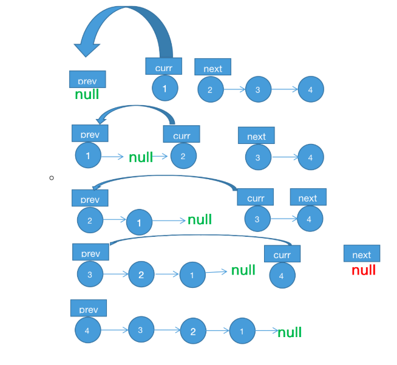

### [25. K 个一组翻转链表](https://leetcode-cn.com/problems/reverse-nodes-in-k-group/)

难度：困难

2020/3/29

#### 题目

给你一个链表，每 k 个节点一组进行翻转，请你返回翻转后的链表。

k 是一个正整数，它的值小于或等于链表的长度。

如果节点总数不是 k 的整数倍，那么请将最后剩余的节点保持原有顺序。

 

示例：

给你这个链表：1->2->3->4->5

当 k = 2 时，应当返回: 2->1->4->3->5

当 k = 3 时，应当返回: 3->2->1->4->5

 

说明：

你的算法只能使用常数的额外空间。
你不能只是单纯的改变节点内部的值，而是需要实际进行节点交换。

来源：力扣（LeetCode）
链接：https://leetcode-cn.com/problems/reverse-nodes-in-k-group
著作权归领扣网络所有。商业转载请联系官方授权，非商业转载请注明出处。

#### 题解

毕竟比较菜，这题倒是想过递归或者嵌套这样的作法，依然做不出，迭代大法好




```js
/**
 * Definition for singly-linked list.
 * function ListNode(val) {
 *     this.val = val;
 *     this.next = null;
 * }
 */
/**
 * @param {ListNode} head
 * @param {number} k
 * @return {ListNode}
 */
var reverseKGroup = function(head, k) {
  let current = head;
  let count = 0;
  while (current != null && count != k) {
    current = current.next;
    count++;
  }
  if (count == k) {
    current = reverseKGroup(current, k);
    while (count != 0) {
      count--;
      let tmp = head.next;
      head.next = current;
      current = head;
      head = tmp;
    }
    head = current;
  }
  return head;
};

```

