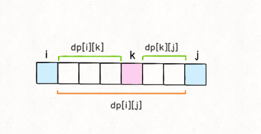

## [312. 戳气球](https://leetcode-cn.com/problems/burst-balloons/)

难度：困难

2020/7/19

#### 题目

有 n 个气球，编号为0 到 n-1，每个气球上都标有一个数字，这些数字存在数组 nums 中。

现在要求你戳破所有的气球。如果你戳破气球 i ，就可以获得 nums[left] * nums[i] * nums[right] 个硬币。 这里的 left 和 right 代表和 i 相邻的两个气球的序号。注意当你戳破了气球 i 后，气球 left 和气球 right 就变成了相邻的气球。

求所能获得硬币的最大数量。

说明:

- 你可以假设 nums[-1] = nums[n] = 1，但注意它们不是真实存在的所以并不能被戳破。

- 0 ≤ n ≤ 500, 0 ≤ nums[i] ≤ 100

示例:

```
输入: [3,1,5,8]
输出: 167 
解释: nums = [3,1,5,8] --> [3,5,8] -->   [3,8]   -->  [8]  --> []
     coins =  3*1*5      +  3*5*8    +  1*3*8      + 1*8*1   = 167
```

来源：力扣（LeetCode）
链接：https://leetcode-cn.com/problems/burst-balloons
著作权归领扣网络所有。商业转载请联系官方授权，非商业转载请注明出处。

#### 题解

所谓动态规划就是结合分治的思想，把原问题拆成子问题求解，一般有自底向上和自顶向下

动态规划问题有四个步骤：

1.划分状态,即划分子问题

2.状态表示，就是让计算机理解子问题

3.状态转移，就是说子问题该怎么推向父问题

4.确定边界，确定初始状态是什么

**此题苦难，原因在于，这个问题中我们每戳破一个气球 `nums[i]`，得到的分数和该气球相邻的气球 `nums[i-1]` 和 `nums[i+1]` 是有相关性的**。

所以，进行一下思路转换，把戳气球变成加气球

其实气球 i 和气球 j 之间的所有气球都可能是最后被戳破的那一个，不防假设为 k。回顾动态规划的套路，这里其实已经找到了「状态」和「选择」：i 和 j 就是两个「状态」，最后戳破的那个气球 k 就是「选择」。

**根据刚才对 `dp` 数组的定义，如果最后一个戳破气球 `k`，`dp[i][j]` 的值应该为**：

```
dp[i][j] = dp[i][k] + dp[k][j]+ points[i]*points[k]*points[j]
```



结合这个图，就能体会出 dp 数组定义的巧妙了。由于是开区间，dp[i][k] 和 dp[k][j] 不会影响气球 k；而戳破气球 k 时，旁边相邻的就是气球 i 和气球 j 了，最后还会剩下气球 i 和气球 j，这也恰好满足了 dp 数组开区间的定义。


```js
/**
 * @param {number[]} nums
 * @return {number}
 */
var maxCoins = function(nums) {
    let n = nums.length;
    let dp = new Array(n + 2).fill(0);
    for (let i = 0; i < n + 2; i++){
        dp[i] = new Array(n + 2).fill(0);
    }
    let val = new Array(n + 2).fill(0);
    // 添加首尾虚拟气球
    val[0] = val[n + 1] = 1;
    // 气球编号赋值为数组
    for (let i = 1; i <= n; i++){
        val[i] = nums[i - 1];
    }
    // 二维数组 dp[i][j]从底向上遍历
    for (let i = n; i >= 0; i--){
        for (let j = i + 1; j < n + 2; j++){
            // 假设最后被戳破的气球是k k应该在i,j之间
            for (let k = i + 1; k < j; k++){
                dp[i][j] = Math.max(dp[i][j], 
                // 子问题就是开区间(i, k) (k, j)
                dp[i][k] + dp[k][j] + val[i] * val[j] * val[k]);   
            }
        }
    }
    // 最终状态只剩添加的两个虚拟气球
    return dp[0][n + 1];
};
```

