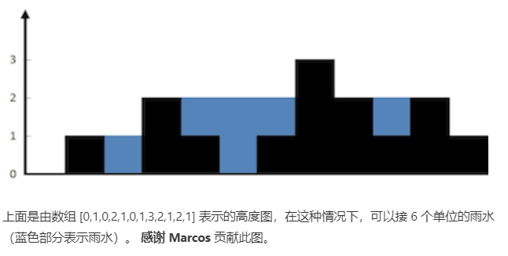

### [42. 接雨水](https://leetcode-cn.com/problems/trapping-rain-water/)

难度：困难

2020/4/6

#### 题目

给定 *n* 个非负整数表示每个宽度为 1 的柱子的高度图，计算按此排列的柱子，下雨之后能接多少雨水。



示例:

```
输入: [0,1,0,2,1,0,1,3,2,1,2,1]
输出: 6
```

来源：力扣（LeetCode）
链接：https://leetcode-cn.com/problems/trapping-rain-water
著作权归领扣网络所有。商业转载请联系官方授权，非商业转载请注明出处。

#### 题解

对于x轴上的每一个单位来说，头和位不算，每个格子会上升的水量又两边的最大值结合短板效应决定

```js
/**
 * @param {number[]} height
 * @return {number}
 */
var trap = function (height) {
  let sum = 0;
  for (let index = 1; index < height.length - 1; index++) {
    let leftMax = 0;
    for (let i = index - 1; i >= 0; i--) {
      leftMax = leftMax > height[i] ? leftMax : height[i];
    }
    let rightMax = 0;
    for (let j = index + 1; j < height.length; j++) {
      rightMax = rightMax > height[j] ? rightMax : height[j];
    }
    let min = Math.min(leftMax, rightMax);
    if (min > height[index]) {
      sum = sum + min - height[index];
    }
  }
  return sum;
};

```

